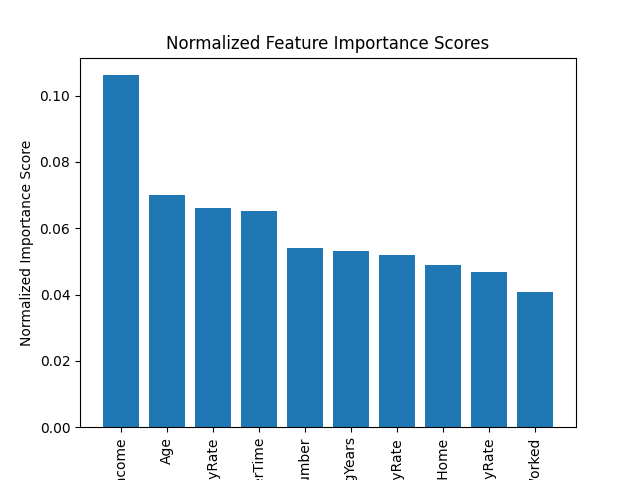

# Employee Attrition | Data Science Project

## Introduction
The objective of this project is to train a model that is able to predict the attrition (leaving their job) level of an employee, as well as uncovering the factors that are most likely to lead to employee attrition.
Some question that will be answered by this prpjects are:
1. What are some employee attributres that contribute the most to their attrition?
2. Given the attributes of an employee, predict attrition.
3. Which department has the highest level of attrition?

Here is an exaple of the first few rows of the data set

## Selection of Data
The source of the dataset used to train and test this modde is Keggle. The link can be found [here](https://www.kaggle.com/datasets/whenamancodes/hr-employee-attrition)

- To make working with this data easier, some non-numeric attributes such as Educaton, are converted to numbers.

View Conversions

Education
| Raw Value | Numeric Representation |
| --- | --- |
| 'Below College | 1 |
| 'College' | 2 |
| 'Bachelor' | 3 |
| 'Doctor' | 4 |

Click to view an exhaustive list of the datasets columns

    
| Column | Example Value |
| --- | --- |
| Age | 41 |
| Attrition | Yes |
| BusinessTravel | Travel_Rarely |
| DailyRate | 1102 |
| Department | Sales |
| DistanceFromHome | 1 |
| Education | 2 |
| EducationField | Life Sciences |
| EmployeeCount | 1 |
| EmployeeNumber | 1 |
| EnvironmentSatisfaction | 2 |
| Gender | Female |
| HourlyRate | 94 |
| JobInvolvement | 3 |
| JobLevel | 2 |
| JobRole | Sales Executive |
| JobSatisfaction | 4 |
| MaritalStatus | Single |
| MonthlyIncome | 5993 |
| MonthlyRate | 19479 |
| NumCompaniesWorked | 8 |
| Over18 | Y |
| OverTime | Yes |
| PercentSalaryHike | 11 |
| PerformanceRating | 3 |
| RelationshipSatisfaction | 1 |
| StandardHours | 80 |
| StockOptionLevel | 0 |
| TotalWorkingYears | 8 |
| TrainingTimesLastYear | 0 |
| WorkLifeBalance | 1 |
| YearsAtCompany | 6 |
| YearsInCurrentRole | 4 |
| YearsSinceLastPromotion | 0 |
| YearsWithCurrManager | 5 |

## Methods
Tools used to clean and interpert data:
- Kaggle for acquiring a free and public dataset
- Python (NumPy and Pandas) for analysis
- VS Code to edit code
- Github to store source code, results and graphs, and the dataset

Tools used to create learnig models
- sklearn.ensemble for the RandomForestRegressor class and well as the RandomForestClassifier model
- sklearn.metrics for assesing th accurecy level of the mdodel

#### Random Tree Classifiers
A Random Forest Classifier is an ensemble machine learning model that combines multiple decision trees to make predictions. It constructs a forest of decision trees during training and outputs the mode (most frequent) prediction of the individual trees for classification tasks. 

#### Random Tree Regressor
A Random Forest Regressor is an ensemble machine learning model that employs multiple decision trees to predict continuous numeric values. It builds a forest of decision trees during training and averages the predictions of individual trees to obtain the final regression output.

## Results
### What are some employee attributres that contribute the most to their attrition?
To answer this question I used a model called RandomForestRegressor. I chose this model because of its high accuracy when it commes to providing insights into the 
different features in making predictions. the model's parameters were left to their default values. After creating the model, I used the attribute `feature_importances_` to get a score that shows how much the value of a column contributes to the value of the target column, that being the one called "Attrition".
The feature impartance score was normalized, to make graphing the infomration a bit easier. The graph of the impartance level of the top 10 columns with the highest score is shown below.

### Given the attributes of an employee, what is the probability of their attrition?
To answer this question, I first trained a model called Random Forrest Classifier becasue it is an algorithm that is often used for classification problems, where the goal is to predict the category of an input based on its features. the model was trained on 80% of the data sets data, and tested on the other 20%. Traing and testing data rows were chosen at random. The model can predict attrition with 87% accuracy. 
#### Future Work
To use the model in real time, I will write a CLI that asks the user for an employees attributes (the 10 most important ones shown in graph above). The model will then let the user know whether this employee is likely to depart, alongside the accuracy level.
### Which departments have the highest levels of attrition?

## Discussion 
